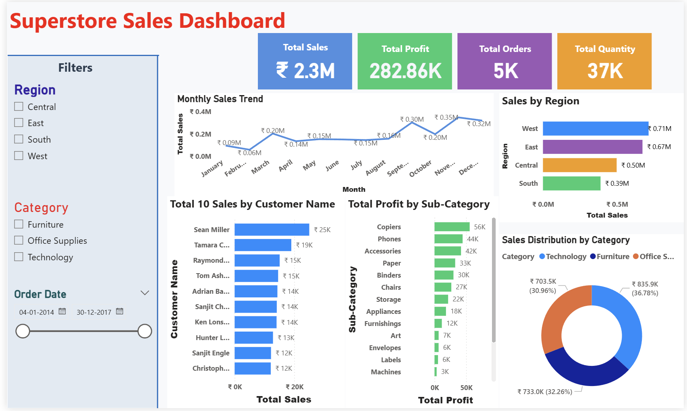
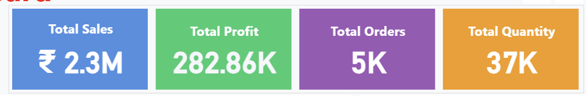
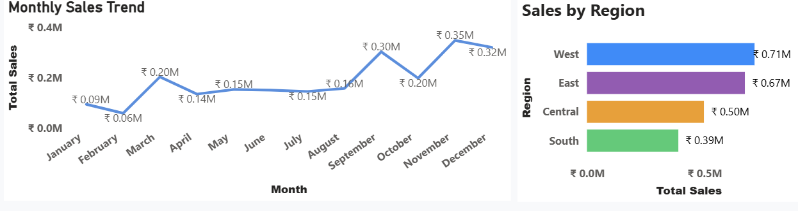

# 📊 Superstore Sales Dashboard

## 📌 Overview
This project presents an interactive Power BI dashboard designed to analyze sales performance, profitability, and customer behavior. It enables data-driven decision-making through clear and dynamic visualizations.

---

## 🛠️ Tools & Technologies
- Power BI  
- SQL  
- Python (Exploratory Data Analysis)

---

## 📈 Key Insights
- Identified top-performing regions and high-value customers  
- Analyzed monthly sales trends to track business performance  
- Developed KPI metrics including Sales, Profit, and Orders  
- Highlighted patterns to support strategic business decisions  

---

## 📷 Dashboard Preview

### 🔹 Overview

### 🔹 KPI Metrics

### 🔹 Sales Trends

---

## 🚀 Project Highlights
- Interactive dashboard with filters and slicers  
- Business-focused insights for decision-making  
- Clean and user-friendly visual design  
